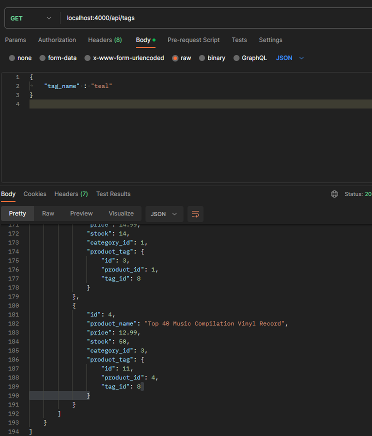

# E-Commerce-Back-End
Backend code for an e-commerce site

# E-Commerce Back-End

## Video Walkthrough
https://drive.google.com/file/d/1QpasOnh9NbvQeAfC3v6a01s_tI6Lbbo-/view

## Description

A practice assignment using Sequelize to access  SQL Queries. Working on this assignment, I learned how to make SQL queries using Sequelize and how to think of relationed databases as classes.

## Table of Contents

- [Installation](#installation)
- [Usage](#usage)
- [License](#license)
- [Questions](#questions?)

## Installation

The necessary applications to run this program are:
In CLI, type "npm i" to install dependencies. Next, in SQL CLI, type "source <db path from files>". In CLI, type "npm run seed". Finally,in CLI, "npm start" to begin application. Everything in this application is backend.

## Usage

Using Postman or Insomnia (or any similar workspace for testing routes), GET, POST, PUT, or DELETE anything from the Products, Tags, and Categories models.

## License 

[MIT](https://choosealicense.com/licenses/mit/)

## Questions? 

If you have questions or have noticed a bug in this code, please reach out:
Name: Alejandra Bernabel
Email: alejandra.e.bernabel@gmail.com
GitHub: alejandra-e-bernabel
